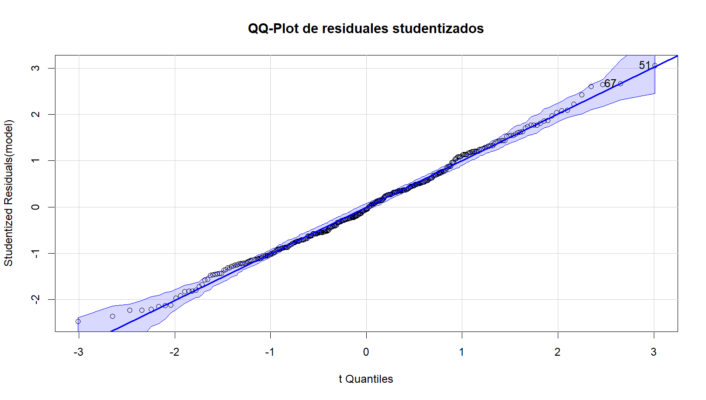
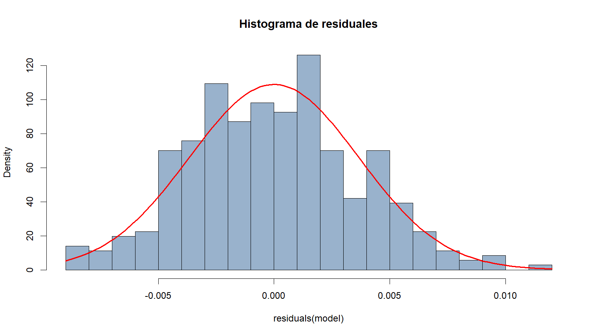
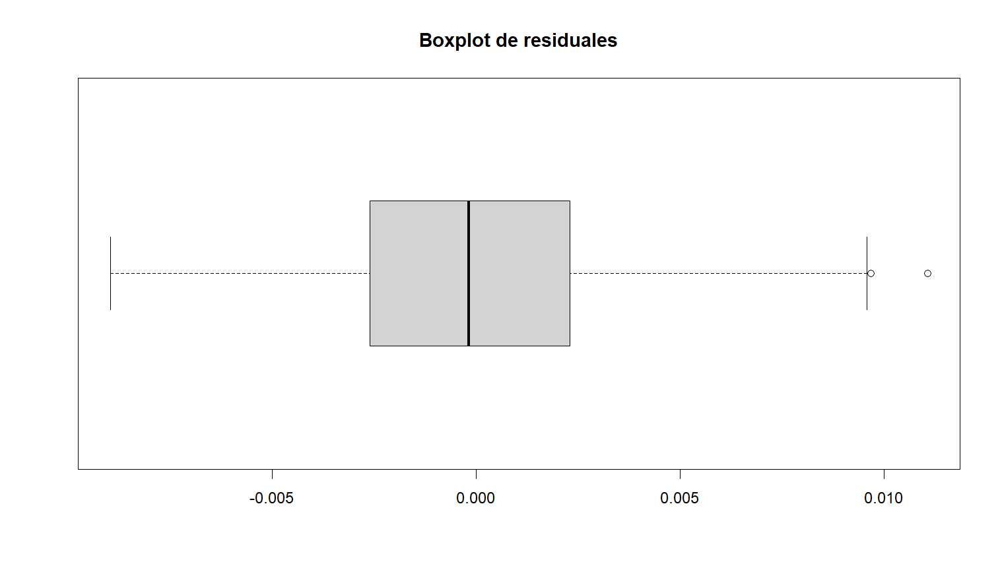
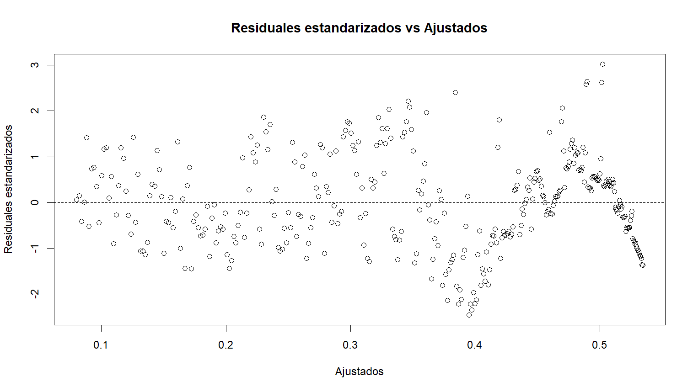
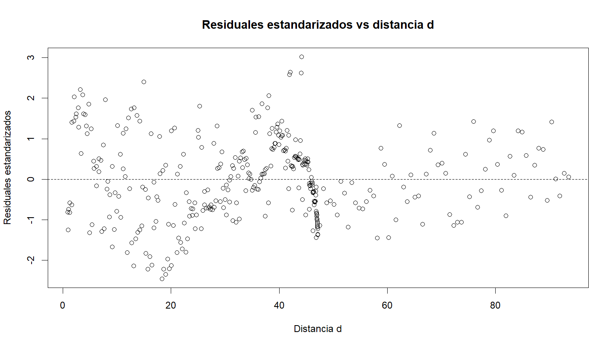
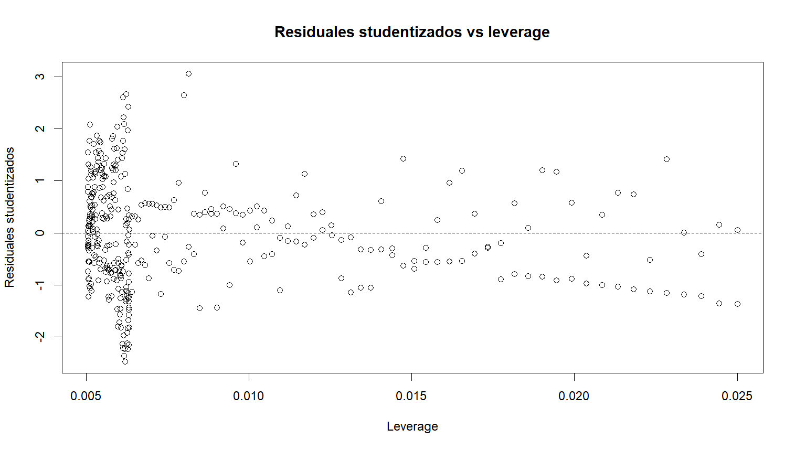
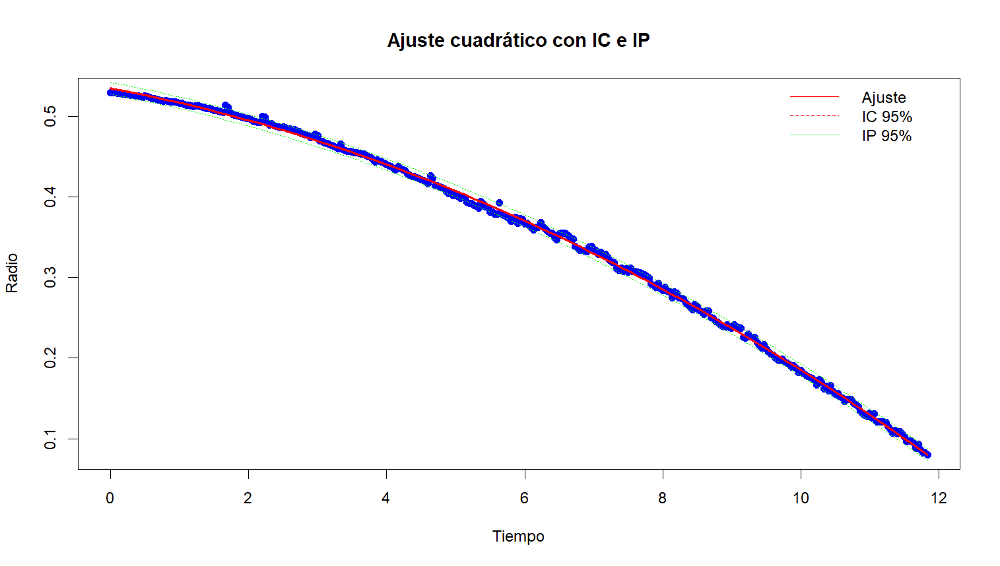

# 🧠 Maxweel Detection — Análisis de Trayectorias Circulares con Visión Artificial, CUDA y Diagnóstico Estadístico

Este prototipo simula la detección de trayectorias circulares mediante visión artificial, con soporte para aceleración por GPU mediante **CUDA**. Emplea detección con YOLOv8, seguimiento con SORT, ajuste de curvas cuadráticas y análisis estadístico con exportación a base de datos.

---

## ⚙️ Requisitos del Sistema

- Python 3.8+
- GPU NVIDIA compatible con CUDA (opcional pero recomendado)
- CUDA Toolkit + cuDNN instalados
- OpenCV y Ultralytics (YOLOv8)

---

## 📂 Estructura de Archivos

Maxweel_detection/
├── .venv/ ← Entorno virtual (opcional)
├── Data/
│ └── laboratorio.mp4 ← Video de entrada
├── .gitignore ← Exclusiones de git
├── Deteccion_Yolo.py ← Script principal de detección, seguimiento y análisis
├── output.avi ← Video procesado exportado
├── sort.py ← Algoritmo de seguimiento SORT
├── wheel.pt ← Modelo YOLOv8 entrenado
└── README.md ← Documentación del proyecto

---

## 🚀 ¿Cómo ejecutar?

1. **Clonar el repositorio o copiar la carpeta.**

2. **Activar entorno virtual (opcional pero recomendado):**

```bash
python -m venv .venv
source .venv/bin/activate  # Linux/macOS
.venv\Scripts\activate     # Windows

## 📦 Modelo entrenado

El archivo `wheel.pt` no se encuentra en este repositorio debido a su tamaño.

## 📊 Comparación con método tradicional (R)

Esta sección presenta gráficos de diagnóstico y resultados estadísticos generados mediante **R**, utilizando métodos clásicos de regresión por mínimos cuadrados.  
Su propósito es **comparar los resultados** con los obtenidos por nuestro software automatizado, como parte del proceso de validación.

> ⚠️ **Nota:**  
> Las siguientes imágenes **no fueron generadas por el software principal de este repositorio**, sino por scripts auxiliares escritos en R.  
> Se incluyen **solo como referencia comparativa** para verificar la concordancia entre ambos enfoques.

---

### Figuras de referencia:

#### QQ-Plot de residuales studentizados


#### Histograma de residuales


#### Boxplot de residuales


#### Residuales estandarizados vs valores ajustados


#### Residuales estandarizados vs distancia d


#### Residuales vs orden de observación


#### Residuales studentizados vs leverage


#### Residuales estandarizados vs distancia de Cook


#### Ajuste cuadrático con intervalos de confianza y predicción



📁 Puedes descargarlo desde esta carpeta de Google Drive:

🔗 [Abrir carpeta en Google Drive](https://drive.google.com/drive/folders/1y4VoyEVsQyzBrG7d4gqcnFJ6SJHvPHq1?usp=drive_link)
